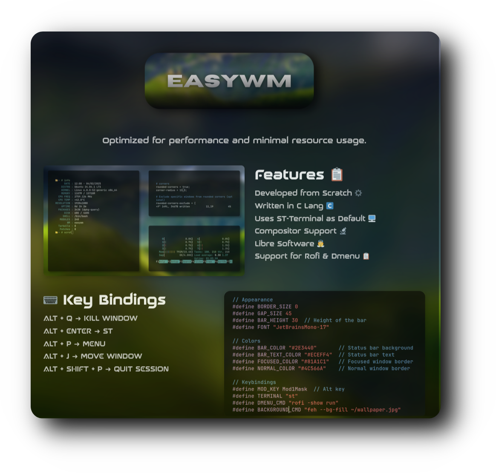

  <h2 style="font-size: 74px;">
    <strong> 
      <a href="https://user7210unix.github.io/easywm-website/" style="text-decoration: none; color: inherit;">
        𝗘𝗔𝗦𝗬𝗪𝗠 - 𝗪𝗘𝗕𝗦𝗜𝗧𝗘
      </a> 
    </strong>
  </h2>

<h1>
      

 
